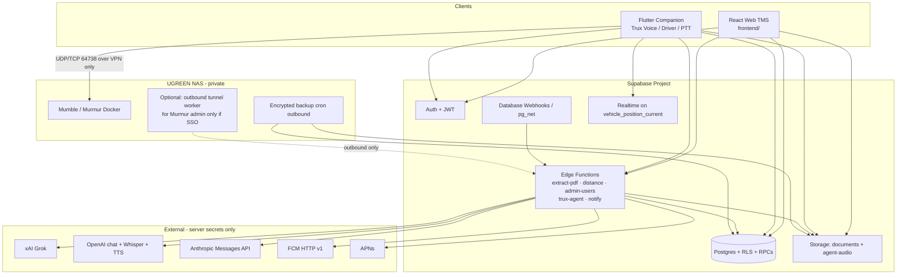
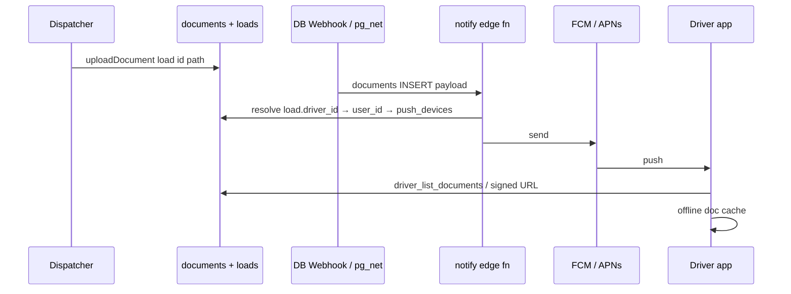

# Trux Companion App — Voice AI + GPS + Mumble PTT

| Field | Value |
|-------|-------|
| **Document title** | Trux Companion App Design (Voice AI, GPS, Mumble PTT) |
| **Author** | _(design / systems architecture)_ |
| **Date** | 2026-07-16 |
| **Status** | Rev 5 — Companion app BUILT 2026-07-17 (login, voice, POD photos, always-on GPS, Mumla PTT, DND alarms). See `mobile/README.md`. |
| **Repo** | `/Users/ike/development/truxon` |
| **Related** | MVP Requirements v1.0; Code Review Developer Handoff (2026-07-15) |

---

## Overview

Truxon is a Supabase-native TMS: a React web app (`frontend/`) talks to Postgres (schema, RLS, SECURITY DEFINER RPCs), Auth, Storage, and Edge Functions. Load workflow, invoicing locks, and audit triggers already live in SQL. The product owner wants a **companion mobile app (Android + iOS)** whose AI assistant is branded **Trux / TRUX**. Users interact by **voice and text**; Trux can execute Truxon actions and confirm completion.

This design extends the existing stack without introducing a new application server for core TMS data. New surface area is:

1. A **Flutter companion app** (drivers + dispatchers/ops on tablets/phones).
2. A **server-side Trux agent** (multi-LLM tool-calling service) that never exposes LLM API keys to the client.
3. **GPS position ingestion** every ~60s while a driver is on duty / on an active load.
4. **Paperwork delivery** to drivers (push + in-app docs + offline cache).
5. **Mumble PTT** hosted on the existing UGREEN NAS, integrated into the companion UX.

The design is explicitly grounded in real paths (`supabase/migrations/*`, `supabase/functions/*`, `frontend/src/data.ts`, `frontend/src/auth.tsx`) and treats **P1 security findings** from the July 2026 code review as **prerequisites** so agent and mobile features do not amplify open RLS/RPC holes.

---

## Background & Motivation

### Current state

| Layer | Reality today |
|-------|----------------|
| Architecture | Supabase-native; NAS only **pulls** encrypted backups (`deploy/backup/backup.sh`) — no inbound app control plane to the NAS today |
| Auth roles | `admin`, `dispatcher`, `driver`, `accountant`, `maintenance` (`public.user_role`) |
| Load workflow | `pending → assigned → in_transit → delivered → completed → billed` enforced in `loads_before_update` + `change_load_status` |
| Status RPC roles | `change_load_status` allows only `admin`, `dispatcher`, `accountant` — **not** `driver` |
| AI PDF | `supabase/functions/extract-pdf` — unpdf + OpenRouter/Groq-compatible LLM (`LLM_API_KEY`, `LLM_BASE_URL`, `LLM_MODEL`); free-form `JSON.parse` on model output |
| Maps | `supabase/functions/distance` — Google Directions for miles (server-side key) |
| Documents | Private Storage bucket `documents` + `public.documents` metadata; path `entity_type/entity_id/…` |
| Storage RLS | **SELECT and INSERT** open to any authenticated user (`20260715200004_storage.sql`); not only SELECT |
| Documents / activity RLS | `documents_select` and `activity_select` use `auth.uid() is not null` — company-wide for any login |
| Driver product | Role exists; **RLS excludes drivers from `loads` SELECT**; no `drivers.user_id`; nav is dashboard-only (`ROLE_MODULES.driver`) |
| Spec | MVP requirements list **driver mobile app**, **GPS tracking**, email invoices as **out of MVP** future |

### Pain points this product solves

1. **Dispatcher friction** — Rate-con → create load → assign truck/driver is multi-step on web (`Dispatch.tsx` + `createLoad` + `updateLoad`). Voice/agent should collapse this into a conversational confirm-and-run loop.
2. **Driver isolation** — Drivers have no first-class mobile surface for assigned loads, paperwork, or status updates; RLS currently blocks load access entirely.
3. **Dispatch visibility** — No live position stream; fleet map is a gap at ~14 trucks and grows with scale.
4. **Radio ops** — Separate radio apps / hardware are another stack; embedding PTT in the companion app reduces context switching.

### Security baseline (must not regress)

From the code-review handoff, **do not route agent or mobile through insecure paths**:

| Finding | Location | Impact if ignored by agent/mobile |
|---------|----------|-----------------------------------|
| 5.1 DEFINER RPCs without role gates | `dashboard_summary()`, `global_search()` in `20260715200002_rpcs.sql` | Driver/agent JWT can pull company-wide financials |
| 5.2 Open storage RLS (SELECT **and** INSERT) | `20260715200004_storage.sql`, `documents` SELECT/INSERT | Any authenticated user can read/write rate cons / BOLs |
| 5.5 PostgREST filter injection | `frontend/src/data.ts` list search | Mobile reuse inherits risk |
| 5.3 Unsafe load/invoice numbering | `next_load_number()` / `next_invoice_number()` | Concurrent agent creates collide |
| 5.4 No double-booking guard | load assign path | Agent can double-assign truck/driver |
| 5.6 `void_invoice` no paid check | `void_invoice()` | Accounting integrity |
| 5.7 Stale profile on token refresh | `frontend/src/auth.tsx` | Demoted/banned user keeps old UX role |
| 6.1 No `drivers.user_id` | `drivers` table | Cannot scope driver loads/GPS |
| 6.2 Nav-only RBAC | `main.tsx` | URL-bypass UX |
| 6.3 Admin edge hardening | `admin-users` | Last-admin / enum validation |
| 6.4 `create_invoice` duplicate load IDs | `create_invoice` | Rate double-count |
| *(gap)* Open `activity_log` SELECT | `activity_select` | Drivers see company-wide notes once they have app logins |

**Prerequisite program (P0 for Companion):** ship security + driver-linkage migrations **before** mobile/agent production traffic. See [Phased Delivery](#phased-delivery) and [PR Plan](#pr-plan).

---

## Goals & Non-Goals

### Goals

1. Ship a dual-platform companion app for **drivers** (loads, docs, GPS, PTT) and **dispatchers/admin** (voice/text agent + PTT + shared ops views).
2. Implement **Trux** as a server-side tool-calling agent over Truxon domain actions, with multi-provider LLM routing (Grok primary; OpenAI + Anthropic pluggable via **provider adapters**).
3. Ingest GPS every **60 seconds** on duty / active load; show positions on web dispatch UI.
4. Deliver load paperwork to the assigned driver (push + in-app + offline cache).
5. Host **Mumble** on UGREEN NAS (Docker preferred); integrate PTT UX (default deep-link; embed only if spike passes).
6. Enforce **least privilege**, full **agent action audit**, and no client-side LLM secrets.
7. Cost-conscious design at current scale (~14 trucks) with a clear growth path.

### Non-Goals (v1 / Companion MVP)

- Replacing the React web TMS; web remains system of record for accounting, users, full CRUD.
- ELD / HOS compliance module, fuel cards, load boards, multi-tenant SaaS.
- Cloud recording of PTT audio (default **off**; see Security).
- Fully autonomous agent without human confirmation for high-impact writes.
- Rewriting legacy FastAPI (`backend/`) — remains reference only.
- On-device LLM inference as the primary agent brain (optional offline STT only).
- Agent control of GPS duty toggle (client-only).
- Invoice tools on the agent (`create_invoice` / `void_invoice` stay web-only in MVP).

---

## Key Decisions

| # | Decision | Rationale |
|---|----------|-----------|
| K1 | **Flutter** for Android + iOS companion | Single codebase; mature background geolocation; platform channels for audio/PTT; models mirror `frontend/src/types.ts`. PWA rejected for Phase 1: unreliable background GPS + mic on iOS Safari, no solid store distribution for always-on tracking. |
| K2 | **Trux Agent as Edge Functions** first, with **hard loop limits** and **out-of-band extract**; graduate to always-on service if needed | Matches `extract-pdf` / `admin-users` / `_shared/auth.ts`. Cold starts are **not** ignored: warm strategy + default path avoids multi-minute tool chains in one invocation (see [Edge runtime](#edge-runtime-limits-and-agent-loop)). |
| K3 | **Never put LLM keys on device**; all completions server-side | Same trust model as `LLM_API_KEY` in `extract-pdf`. |
| K4 | **Default LLM: xAI Grok** (`XAI_API_KEY`, `https://api.x.ai/v1`); OpenAI + Anthropic via **separate provider adapters** | Grok/OpenAI share chat-completions shape; **Anthropic Messages API is first-class, not pretend-OpenAI**. Normalized internal `completeChat` / `parseToolCalls` interface. |
| K5 | **Confirm-before-write** with server-owned proposed rows (TTL, immutable args, single-use execute) | Matches Dispatch extract→review→save; closes double-tap and arg-tamper holes. |
| K6 | **P1 security fixes + `drivers.user_id` are blockers** for companion prod | Agent/mobile amplify open DEFINER/storage holes. |
| K7 | **GPS via `ingest_vehicle_positions` RPC** (user JWT); current pin keyed by **`driver_id`** | Device never holds service role; bobtail / no-truck duty still tracks. |
| K8 | **Mumble on NAS via Docker**; Phase 3 **default = official app deep-link** + ops-provisioned accounts; embed only if spike passes go/no-go criteria | NAS has no inbound control plane today; Edge cannot call private Murmur admin without a reverse tunnel. Private Murmur only over WireGuard (K16). |
| K9 | **Push via edge function `notify` calling FCM HTTP v1 + APNs** (secrets in Supabase); trigger via Database Webhook / `pg_net` on authorized inserts | Supabase does not host a full push pipeline; FCM/APNs are external. |
| K10 | **Phased MVP**: driver app + GPS + docs → voice agent → PTT | Security/driver RLS first (K18). PTT after WireGuard pilot (K16). |
| K11 | **Driver status via new `driver_change_load_status`** — do **not** widen `change_load_status` role list | Ownership + transition allow-list; never `completed`/`billed` for drivers. |
| K12 | **Driver load reads via DEFINER RPCs** (`driver_my_loads` / `driver_get_load`) returning fixed DTOs | Avoids brittle multi-table RLS for joins used by `LOAD_SELECT`; related-entity leakage controlled in one place. |
| K13 | **MVP STT = OpenAI Whisper API; MVP TTS = OpenAI TTS** (`tts-1`) | Single vendor path for voice MVP; audio uploaded to Storage (not giant base64); delete audio after STT. |
| K14 | **Proposed-action TTL = 10 minutes**; max 8 proposed/turn; state machine `proposed → executing → executed\|failed` (never mark executed before tool succeeds) | Crash-safe, idempotent double-tap with stored result. |
| K15 | **Offline driver queue** for status changes + GPS points; online-only for dispatcher agent writes | Cab coverage gaps are real; agent confirm requires online. |
| K16 | **WireGuard for all tablets** — private Murmur on NAS; tablets join company WireGuard; **no public Mumble exposure** | Resolved product decision (Q3). Single VPN topology for drivers/dispatch devices to reach NAS radio and optional future on-prem services. |
| K17 | **Full App Store + Google Play distribution from the start** (not sideload-first pilot) | Resolved product decision (Q6). Requires Apple Developer + Google Play org accounts, privacy labels (location Always, microphone), background-location justification strings, and longer review lead time — dependencies for store submission of PR12–14+, **not** for Phase 0 DB work. |
| K18 | **Implementation priority: land Full Phase 0 + driver linkage stack first = PRs 1–9** | Security through Drivers/Users link UI + `admin-users` `link_driver_id` + admin hardening. **Do not start Flutter or agent work until PRs 1–9 land.** |

---

## Proposed Design

### System architecture



**Trust boundaries**

- Mobile and web use **anon key + user JWT** only.
- Service role stays in edge functions (`admin-users` pattern).
- LLM providers see only authorized extract text / tool context for the caller's role.
- Mumble is **WireGuard-only** (K16); bind Murmur to the VPN interface; **no public Mumble exposure** and no open registration.
- NAS remains pull/outbound by default; any Murmur admin automation is **NAS-local or outbound tunnel**, never Edge → private NAS inbound.

### Client tech choice

#### Comparison

| Criterion | Flutter | React Native / Expo | Kotlin + Swift native | PWA (tablet browser) |
|-----------|---------|---------------------|------------------------|----------------------|
| Dual platform speed | Excellent | Excellent | Poor | Excellent |
| Background GPS | Mature plugins | Good; iOS care | Best | **Weak / unreliable on iOS** |
| Voice mic session | Strong | Strong | Best | Limited background |
| Mumble embed | Platform channels | Native modules | Best | Deep-link only |
| Team fit with React web | Separate language | Closer to TS | Far | Max reuse |
| Store / always-on tracking | Supported | Supported | Supported | Poor for duty GPS |

#### Recommendation: **Flutter**

Rationale: one shippable artifact; background location; models map to `frontend/src/types.ts`.

**Why not PWA for Phase 1:** iOS Safari background geolocation and continuous tracking are not reliable enough for 60s duty GPS; push + offline cache for drivers is weaker; product vision expects a companion **app**. Web remains system of record; companion can deep-link into web for rare ops.

**PTT fallback:** deep-link to official Mumble clients if embed spike fails.

#### App structure (Flutter)

```
mobile/
  lib/
    main.dart
    auth/                 # supabase_flutter email/password
    data/                 # RPCs: driver_my_loads, ingest_vehicle_positions, …
    features/
      driver_home/
      paperwork/
      gps/
      trux_chat/
      ptt/
    services/
      trux_agent_client.dart
      push.dart            # FCM + APNs token registration
      offline_queue.dart   # status + GPS outbox
      offline_docs.dart
```

| Role | Primary tabs |
|------|----------------|
| `driver` | My Loads · Documents · Duty/GPS · Radio |
| `dispatcher` / `admin` | Trux · Active Fleet · Radio · Quick Load |
| others | Guide to web; login allowed |

### Driver ↔ profile linkage (operational design)

Today `public.drivers` has no auth FK (`20260715200001_schema.sql`). Companion requires:

```sql
alter table public.drivers
  add column user_id uuid unique references public.profiles (id) on delete set null;

create index drivers_user_id_idx on public.drivers (user_id)
  where user_id is not null;
```

#### Integrity rules

```sql
-- Linked profile must be role=driver and active
create or replace function public.drivers_user_id_guard()
returns trigger
language plpgsql
security definer set search_path = public
as $$
declare
  r public.user_role;
  active boolean;
begin
  if new.user_id is null then
    return new;
  end if;
  select role, is_active into r, active from public.profiles where id = new.user_id;
  if not found then
    raise exception 'Linked profile not found';
  end if;
  if r <> 'driver' then
    raise exception 'Linked profile must have role=driver';
  end if;
  if not active then
    raise exception 'Linked profile must be active';
  end if;
  return new;
end;
$$;

create trigger drivers_user_id_guard
  before insert or update of user_id on public.drivers
  for each row execute function public.drivers_user_id_guard();

-- When profile role leaves driver or is_active=false, clear link
create or replace function public.profiles_clear_driver_link()
returns trigger
language plpgsql
security definer set search_path = public
as $$
begin
  if (new.role is distinct from old.role and new.role <> 'driver')
     or (new.is_active is distinct from old.is_active and new.is_active = false) then
    update public.drivers set user_id = null where user_id = new.id;
  end if;
  return new;
end;
$$;

create trigger profiles_clear_driver_link
  after update of role, is_active on public.profiles
  for each row execute function public.profiles_clear_driver_link();
```

#### Who may set `user_id`

| Actor | Permission |
|-------|------------|
| `admin` | Always (Users + Drivers UI) |
| `dispatcher` | May link/unlink via Drivers UI (same as today they can `UPDATE drivers`) |
| Self / driver | **Never** |

UI: Drivers page “Link login” picker (profiles with `role=driver`, `is_active`, not already linked). Unlink control with confirm.

#### `admin-users` atomic provision

Extend POST body optionally:

```json
{ "email", "password", "username", "full_name", "role": "driver", "link_driver_id": 42 }
```

When `role=driver` and `link_driver_id` set: create auth user → profile trigger → `UPDATE drivers SET user_id = new.id WHERE id = link_driver_id` under service role in same request; fail if driver already linked.

#### Helper

```sql
create or replace function public.my_driver_id()
returns bigint
language plpgsql
stable
security definer
set search_path = public
as $$
declare
  d_id bigint;
begin
  if auth.uid() is null then
    return null;
  end if;
  select id into d_id from public.drivers where user_id = auth.uid();
  -- unique on user_id guarantees at most one row; no LIMIT 1 ambiguity
  return d_id;
end;
$$;

revoke all on function public.my_driver_id() from public;
grant execute on function public.my_driver_id() to authenticated;
```

Same **REVOKE/GRANT** pattern for all new companion RPCs.

#### Self-read of driver row (optional Phase 1.1)

Drivers do **not** need pay rate on device for MVP. If profile screen is needed later: narrow `drivers_select` policy `user_id = auth.uid()` exposing only non-sensitive columns via a view `driver_me` (`full_name`, `license_expiration`, `status`) — never `pay_per_mile` on mobile.

#### Terminated / banned

- `drivers.status = 'terminated'` → ingest RPC rejects; clear duty.
- `profiles.is_active = false` → `admin-users` ban + global signOut (existing); trigger clears `user_id`.
- App: on any `403` from ingest/my loads with “disabled”, force logout.

#### Ops runbook (provision tablet user)

1. Create operational `drivers` row (or pick existing).
2. Admin → Users: create user `role=driver`, set `link_driver_id` (or link from Drivers page).
3. Set temporary password; force change on first login (optional post-MVP).
4. Install Flutter app; login; grant location + notification permissions.
5. Toggle On Duty once to verify GPS pin on web map.
6. (Phase 3) Create Mumble account with same username; give password out-of-band.

### Driver data access: DEFINER DTOs (not multi-table RLS sprawl)

**Chosen approach: K12 — SECURITY DEFINER RPCs with ownership checks**, not additive SELECT policies on `customers` / `trucks` / `trailers` for drivers.

Rationale: Web `LOAD_SELECT` embeds (`customer:customers`, `truck:trucks`, …) would fail under current staff-only RLS for those tables. Narrow per-table policies for “related to my loads” are easy to get wrong (OR holes, maintenance rows, customer PII). A fixed DTO RPC re-checks `driver_id = my_driver_id()` once and returns only fields the app needs.

#### `driver_my_loads()`

```sql
create or replace function public.driver_my_loads()
returns jsonb
language plpgsql
stable
security definer
set search_path = public
as $$
declare
  d_id bigint := public.my_driver_id();
begin
  if public.my_role() <> 'driver' or d_id is null then
    raise exception 'Not a linked driver' using errcode = '42501';
  end if;

  return coalesce((
    select jsonb_agg(row_to_json(x)::jsonb order by x.pickup_time nulls last)
    from (
      select
        l.id,
        l.load_number,
        l.status,
        l.pickup_address,
        l.pickup_time,
        l.delivery_address,
        l.delivery_time,
        l.special_terms,
        l.notes,
        l.miles,
        -- intentionally omit rate for driver DTO (business choice: hide revenue)
        c.company_name as customer_name,
        t.unit_number as truck_unit,
        tr.unit_number as trailer_unit,
        d.full_name as driver_name
      from public.loads l
      join public.customers c on c.id = l.customer_id
      left join public.trucks t on t.id = l.truck_id
      left join public.trailers tr on tr.id = l.trailer_id
      join public.drivers d on d.id = l.driver_id
      where l.driver_id = d_id
        and l.status in ('assigned', 'in_transit', 'delivered', 'completed')
        -- hide pure pending (not assigned to them) and billed clutter optional:
        -- include completed for recent paperwork; exclude billed after 30d in app filter
    ) x
  ), '[]'::jsonb);
end;
$$;

revoke all on function public.driver_my_loads() from public;
grant execute on function public.driver_my_loads() to authenticated;
```

#### `driver_get_load(p_load_id bigint)`

Same ownership check; single object or exception `P0002` not found / `42501` forbidden. Used for detail screen.

#### `driver_list_documents(p_load_id bigint)`

```sql
-- returns id, doc_type, filename, content_type, size_bytes, uploaded_at, storage_path
-- only if load.driver_id = my_driver_id()
-- does NOT grant blanket documents table SELECT
```

Download: prefer **edge function `driver-doc-url`** that verifies ownership then returns a **short-lived signed Storage URL** (60–300s). That way storage object policies need not teach path parsing for every role.

#### Table RLS for drivers (minimal)

| Table | Driver policy |
|-------|----------------|
| `loads` | Optional direct SELECT for own `driver_id` **or** rely solely on RPCs (recommend **RPC-only** for mobile; no broad `loads` policy if DTO omits rate) |
| `customers` / `trucks` / `trailers` | **No** driver SELECT |
| `documents` | **No** blanket SELECT; staff policies only + signed URL path |
| `activity_log` | **No** driver SELECT of company-wide log; optional `driver_list_notes(load_id)` returning notes for own loads only |
| `vehicle_positions` / `vehicle_position_current` | Driver: insert via RPC only; SELECT own current pin optional |
| Staff | Unchanged SELECT on positions for map |

#### SQL tests (required)

- Driver JWT: `driver_my_loads` returns only own loads; cannot call with forged context.
- Driver JWT: `select * from customers` empty/denied; `select * from loads` denied or empty.
- Driver JWT: `driver_list_documents` other driver's load → forbidden.
- Driver JWT: **direct `driver_load_dto(id)` fails** (no EXECUTE) — must not be a free-read path.
- Driver JWT: `driver_get_load` / status RPC only for owned loads; DTO has no `rate`.
- Staff JWT: still full load joins via existing table RLS.

### Driver status RPC (does not weaken `change_load_status`)

**Do not** add `driver` to `change_load_status`'s role allow-list. That function has no ownership check today beyond role; widening role would let any driver pass any `p_load_id`.

**Return type:** must **not** be `public.loads` (would leak `rate`, `invoice_id`, etc. on every status change). Return the same **driver DTO jsonb** shape as `driver_get_load` (no rate).

```sql
-- INTERNAL projection helper ONLY — not a client-facing RPC.
-- SECURITY DEFINER bypasses RLS; must NOT be granted to authenticated/anon
-- or any login can enumerate load_id and read addresses/notes for others.
-- Call only from ownership-checked DEFINER entrypoints:
--   driver_get_load, driver_change_load_status, (optional) driver_my_loads.
-- Intentionally omits rate, invoice_id, and other staff-only fields.
create or replace function public.driver_load_dto(p_load_id bigint)
returns jsonb
language sql
stable
security definer
set search_path = public
as $$
  select jsonb_build_object(
    'id', l.id,
    'load_number', l.load_number,
    'status', l.status,
    'pickup_address', l.pickup_address,
    'pickup_time', l.pickup_time,
    'delivery_address', l.delivery_address,
    'delivery_time', l.delivery_time,
    'special_terms', l.special_terms,
    'notes', l.notes,
    'miles', l.miles,
    'customer_name', c.company_name,
    'truck_unit', t.unit_number,
    'trailer_unit', tr.unit_number,
    'driver_name', d.full_name
  )
  from public.loads l
  join public.customers c on c.id = l.customer_id
  left join public.trucks t on t.id = l.truck_id
  left join public.trailers tr on tr.id = l.trailer_id
  join public.drivers d on d.id = l.driver_id
  where l.id = p_load_id;
$$;

-- Lock down: no PostgREST / client execute path
revoke all on function public.driver_load_dto(bigint) from public;
revoke all on function public.driver_load_dto(bigint) from anon, authenticated;
-- Intentionally NO grant execute to authenticated or anon.
-- Postgres default: owner (migration role / supabase_admin) retains execute
-- so other SECURITY DEFINER functions in public can still call it.

create or replace function public.driver_change_load_status(
  p_load_id bigint,
  p_status public.load_status
)
returns jsonb  -- driver DTO only; NEVER returns public.loads / rate
language plpgsql
security definer
set search_path = public
as $$
declare
  l public.loads;
  d_id bigint := public.my_driver_id();
  allowed boolean;
  prev public.load_status;
begin
  if public.my_role() <> 'driver' or d_id is null then
    raise exception 'Not enough permissions' using errcode = '42501';
  end if;

  select * into l from public.loads where id = p_load_id for update;
  if not found then
    raise exception 'Load not found' using errcode = 'P0002';
  end if;
  if l.driver_id is distinct from d_id then
    raise exception 'Not your load' using errcode = '42501';
  end if;

  prev := l.status;

  -- Forward-only operational transitions; no completed/billed; no backward
  allowed :=
    (l.status = 'assigned' and p_status = 'in_transit')
    or (l.status = 'in_transit' and p_status = 'delivered');

  if not allowed then
    raise exception 'Driver cannot change status from % to %', l.status, p_status;
  end if;

  -- Reuse session flag + audit pattern from change_load_status
  perform set_config('app.load_rpc', '1', true);
  update public.loads set status = p_status where id = p_load_id;
  perform set_config('app.load_rpc', '', true);

  insert into public.activity_log (entity_type, entity_id, user_id, action, detail)
  values (
    'load', p_load_id, auth.uid(), 'status_changed',
    'driver: ' || prev::text || ' → ' || p_status::text
  );

  -- Project through INTERNAL helper so rate never appears in the RPC response.
  -- Ownership already enforced above; do not expose driver_load_dto to clients.
  return public.driver_load_dto(p_load_id);
end;
$$;

revoke all on function public.driver_change_load_status(bigint, public.load_status) from public;
grant execute on function public.driver_change_load_status(bigint, public.load_status) to authenticated;
```

#### Client-facing entrypoints vs internal helpers

| Function | Grant `authenticated` | Authz |
|----------|----------------------|--------|
| `driver_load_dto` | **No** (internal only) | None inside helper — callers must check first |
| `driver_get_load(p_load_id)` | Yes | `my_role()=driver` + `driver_id = my_driver_id()` then `driver_load_dto` |
| `driver_change_load_status` | Yes | Ownership + transition allow-list then `driver_load_dto` |
| `driver_my_loads` | Yes | Builds list with same projection (inline or internal helper after `my_driver_id` filter) |
| `driver_list_documents` | Yes | Load ownership check |

`driver_get_load` sketch:

```sql
create or replace function public.driver_get_load(p_load_id bigint)
returns jsonb
language plpgsql stable security definer set search_path = public
as $$
declare
  d_id bigint := public.my_driver_id();
  owner bigint;
begin
  if public.my_role() <> 'driver' or d_id is null then
    raise exception 'Not enough permissions' using errcode = '42501';
  end if;
  select driver_id into owner from public.loads where id = p_load_id;
  if not found then
    raise exception 'Load not found' using errcode = 'P0002';
  end if;
  if owner is distinct from d_id then
    raise exception 'Not your load' using errcode = '42501';
  end if;
  return public.driver_load_dto(p_load_id);  -- internal call OK
end;
$$;

revoke all on function public.driver_get_load(bigint) from public;
grant execute on function public.driver_get_load(bigint) to authenticated;
```

**Regression tests (required in PR8 SQL suite):**

1. Driver JWT: `select public.driver_load_dto(<any_load_id>)` → **permission denied** (no EXECUTE for `authenticated`).
2. Driver JWT: `driver_get_load(own_load)` → 200 DTO, no `rate` key.
3. Driver JWT: `driver_get_load(other_driver_load)` → `42501` / not your load.
4. Driver JWT: `driver_change_load_status` success body has no `rate`; shape matches `driver_get_load`.
5. Maintenance/accountant JWT: cannot execute `driver_load_dto` either.

**Product decision (resolves Open Question 1):** `delivered → completed` and all accounting transitions remain **dispatcher/admin/accountant** via existing `change_load_status`. Completed means paperwork verified — not a cab action.

Staff `change_load_status` stays as today (including backward corrections for staff) and may continue to return `public.loads` for staff only.

### Duty state

```sql
create table public.driver_duty (
  driver_id bigint primary key references public.drivers (id) on delete cascade,
  is_on_duty boolean not null default false,
  on_duty_since timestamptz,
  updated_at timestamptz not null default now(),
  updated_by uuid references public.profiles (id)
);

create or replace function public.driver_set_duty(p_on_duty boolean)
returns public.driver_duty
language plpgsql
security definer set search_path = public
as $$
declare
  d_id bigint := public.my_driver_id();
  row public.driver_duty;
begin
  if public.my_role() <> 'driver' or d_id is null then
    raise exception 'Not enough permissions';
  end if;
  if (select status from public.drivers where id = d_id) <> 'active' then
    raise exception 'Driver not active';
  end if;

  insert into public.driver_duty (driver_id, is_on_duty, on_duty_since, updated_by, updated_at)
  values (
    d_id, p_on_duty,
    case when p_on_duty then now() else null end,
    auth.uid(), now()
  )
  on conflict (driver_id) do update set
    is_on_duty = excluded.is_on_duty,
    on_duty_since = case when excluded.is_on_duty then coalesce(public.driver_duty.on_duty_since, now()) else null end,
    updated_by = excluded.updated_by,
    updated_at = now()
  returning * into row;
  return row;
end;
$$;
```

Tracking allowed when: `is_on_duty` **or** driver has a load in `assigned`/`in_transit`.

### GPS tracking

#### Behavior

- Sample every **60s** while tracking allowed.
- Offline: queue points locally; flush via batch RPC.
- Stationary > 5 min: may keep 60s cadence but lower accuracy mode (battery).
- Stop on logout / off-duty with no active load / terminated.

#### Permissions

| Platform | Requirements |
|----------|----------------|
| Android | Fine location + foreground service `location`; background location with education screen |
| iOS | When-In-Use + Always with purpose string; background mode `location` |

#### Data model (bobtail-safe)

`vehicle_position_current` is keyed by **`driver_id`**, not `truck_id`. Map pins are “driver last known”; truck unit shown when known from active load.

```sql
create table public.vehicle_positions (
  id bigint generated always as identity primary key,
  driver_id bigint not null references public.drivers (id),
  truck_id bigint references public.trucks (id),  -- nullable (bobtail / unknown)
  load_id bigint references public.loads (id),    -- nullable when on duty empty
  user_id uuid not null references public.profiles (id),
  recorded_at timestamptz not null,
  received_at timestamptz not null default now(),
  lat double precision not null check (lat between -90 and 90),
  lng double precision not null check (lng between -180 and 180),
  speed_mps double precision,
  heading_deg double precision,
  accuracy_m double precision,
  battery_pct smallint,
  source text not null default 'companion_app',
  constraint vehicle_positions_recorded_not_future
    check (recorded_at <= now() + interval '5 minutes')
);

create index vehicle_positions_driver_time_idx
  on public.vehicle_positions (driver_id, recorded_at desc);
create index vehicle_positions_truck_time_idx
  on public.vehicle_positions (truck_id, recorded_at desc)
  where truck_id is not null;

create table public.vehicle_position_current (
  driver_id bigint primary key references public.drivers (id) on delete cascade,
  truck_id bigint references public.trucks (id),
  load_id bigint references public.loads (id),
  lat double precision not null,
  lng double precision not null,
  speed_mps double precision,
  heading_deg double precision,
  accuracy_m double precision,
  recorded_at timestamptz not null,
  updated_at timestamptz not null default now()
);

-- RLS
alter table public.vehicle_positions enable row level security;
alter table public.vehicle_position_current enable row level security;
alter table public.driver_duty enable row level security;

-- Staff read all current + history
create policy vpc_staff_select on public.vehicle_position_current
  for select to authenticated
  using (public.my_role() in ('admin', 'dispatcher', 'accountant'));

create policy vp_staff_select on public.vehicle_positions
  for select to authenticated
  using (public.my_role() in ('admin', 'dispatcher', 'accountant'));

-- Drivers: no direct INSERT; RPC only. Optional: select own current
create policy vpc_driver_select_own on public.vehicle_position_current
  for select to authenticated
  using (public.my_role() = 'driver' and driver_id = public.my_driver_id());

create policy duty_driver_all on public.driver_duty
  for all to authenticated
  using (driver_id = public.my_driver_id())
  with check (driver_id = public.my_driver_id());
-- (prefer RPC-only for duty writes; policy above if table access needed)

-- Realtime: publish vehicle_position_current for authenticated staff
-- (supabase_realtime publication add table)
```

#### Ingest RPC (full contract)

```sql
create type public.vehicle_position_input as (
  lat double precision,
  lng double precision,
  recorded_at timestamptz,
  speed_mps double precision,
  heading_deg double precision,
  accuracy_m double precision,
  battery_pct int,
  load_id bigint  -- optional client hint; server re-validates
);

create or replace function public.ingest_vehicle_positions(
  p_points public.vehicle_position_input[]
)
returns jsonb  -- { accepted: int, rejected: jsonb[] }
language plpgsql
security definer
set search_path = public
as $$
declare
  d_id bigint := public.my_driver_id();
  pt public.vehicle_position_input;
  active_load public.loads;
  t_id bigint;
  load_id bigint;
  last_at timestamptz;
  accepted int := 0;
  rejected jsonb := '[]'::jsonb;
  min_interval interval := interval '45 seconds';
  skew interval := interval '5 minutes';
  i int;
begin
  if public.my_role() <> 'driver' or d_id is null then
    raise exception 'Only linked drivers may ingest positions' using errcode = '42501';
  end if;
  if (select status from public.drivers where id = d_id) <> 'active' then
    raise exception 'Driver not active' using errcode = '42501';
  end if;
  if p_points is null or cardinality(p_points) = 0 then
    raise exception 'No points' using errcode = '22023';
  end if;
  if cardinality(p_points) > 60 then
    raise exception 'Max 60 points per batch' using errcode = '22023';
  end if;

  -- Resolve single active load: prefer unique assigned/in_transit for this driver
  select * into active_load
    from public.loads
   where driver_id = d_id
     and status in ('assigned', 'in_transit')
   order by
     case status when 'in_transit' then 0 else 1 end,
     pickup_time nulls last
   limit 1;
  -- After PR3 double-booking fix, at most one active load per driver.
  -- If multiple still exist (legacy data), pick in_transit first then earliest pickup.

  if active_load.id is null then
    -- on duty without load (bobtail / waiting)
    if not exists (
      select 1 from public.driver_duty where driver_id = d_id and is_on_duty
    ) then
      raise exception 'Not on duty and no active load' using errcode = '42501';
    end if;
    t_id := null;
    load_id := null;
  else
    t_id := active_load.truck_id;  -- may be null if data incomplete
    load_id := active_load.id;
  end if;

  select max(recorded_at) into last_at
    from public.vehicle_positions
   where driver_id = d_id
     and recorded_at > now() - interval '1 day';

  -- REQUIRED: sort batch by recorded_at ascending before rate-limit / current upsert.
  -- Offline queues often arrive out of order; unsorted input can reject valid points
  -- as too_frequent or regress vehicle_position_current mid-batch.
  -- Implementation: copy p_points into a temp array / unnest ORDER BY recorded_at, then loop.
  -- Clients SHOULD also sort before send; server MUST sort regardless.
  -- Pseudocode equivalent:
  --   sorted := (SELECT array_agg(p ORDER BY p.recorded_at) FROM unnest(p_points) p);

  for i in 1 .. cardinality(p_points) loop  -- iterate sorted points, not raw client order
    pt := p_points[i];  -- after sort: p_points[i] is i-th by recorded_at ASC

    if pt.lat is null or pt.lng is null or pt.recorded_at is null then
      rejected := rejected || jsonb_build_array(jsonb_build_object('i', i, 'error', 'missing_fields'));
      continue;
    end if;
    if pt.lat < -90 or pt.lat > 90 or pt.lng < -180 or pt.lng > 180 then
      rejected := rejected || jsonb_build_array(jsonb_build_object('i', i, 'error', 'bad_coords'));
      continue;
    end if;
    -- clock skew: reject future > 5m; reject older than 24h (stale offline)
    if pt.recorded_at > now() + skew then
      rejected := rejected || jsonb_build_array(jsonb_build_object('i', i, 'error', 'future_timestamp'));
      continue;
    end if;
    if pt.recorded_at < now() - interval '24 hours' then
      rejected := rejected || jsonb_build_array(jsonb_build_object('i', i, 'error', 'too_old'));
      continue;
    end if;
    -- optional client load_id must match resolved active load when both set
    if pt.load_id is not null and load_id is not null and pt.load_id is distinct from load_id then
      rejected := rejected || jsonb_build_array(jsonb_build_object('i', i, 'error', 'load_mismatch'));
      continue;
    end if;
    -- rate limit vs last accepted (including prior in batch)
    if last_at is not null and pt.recorded_at < last_at + min_interval then
      rejected := rejected || jsonb_build_array(jsonb_build_object('i', i, 'error', 'too_frequent'));
      continue;
    end if;

    insert into public.vehicle_positions (
      driver_id, truck_id, load_id, user_id, recorded_at,
      lat, lng, speed_mps, heading_deg, accuracy_m, battery_pct
    ) values (
      d_id, t_id, load_id, auth.uid(), pt.recorded_at,
      pt.lat, pt.lng, pt.speed_mps, pt.heading_deg, pt.accuracy_m, pt.battery_pct
    );

    -- Upsert current only if this point is newest
    insert into public.vehicle_position_current as c (
      driver_id, truck_id, load_id, lat, lng, speed_mps, heading_deg, accuracy_m, recorded_at, updated_at
    ) values (
      d_id, t_id, load_id, pt.lat, pt.lng, pt.speed_mps, pt.heading_deg, pt.accuracy_m, pt.recorded_at, now()
    )
    on conflict (driver_id) do update set
      truck_id = excluded.truck_id,
      load_id = excluded.load_id,
      lat = excluded.lat,
      lng = excluded.lng,
      speed_mps = excluded.speed_mps,
      heading_deg = excluded.heading_deg,
      accuracy_m = excluded.accuracy_m,
      recorded_at = excluded.recorded_at,
      updated_at = now()
    where c.recorded_at is distinct from excluded.recorded_at
      and c.recorded_at < excluded.recorded_at;

    last_at := pt.recorded_at;
    accepted := accepted + 1;
  end loop;

  return jsonb_build_object('accepted', accepted, 'rejected', rejected);
end;
$$;

revoke all on function public.ingest_vehicle_positions(public.vehicle_position_input[]) from public;
grant execute on function public.ingest_vehicle_positions(public.vehicle_position_input[]) to authenticated;
```

**Error codes for client:** `42501` authz, `22023` bad input, `P0002` not found (other RPCs).

**Attribution (resolves Open Question 4):** Primary pin entity = **driver**. `truck_id` / `load_id` denormalized from active load when present; null when on duty without truck (bobtail / yard).

Volume @ 14 trucks, 12h duty, 60s: ≈ **10,080 points/day**; retain 90 days hot.

#### Web map UI

- Component: `frontend/src/pages/FleetMap.tsx` embedded in Dispatch (tab) and optional Dashboard card.
- Data: Supabase Realtime subscription on `vehicle_position_current` (staff RLS); fallback poll 30s if Realtime unavailable.
- Pins: lat/lng from DB only — **no Directions calls per pin**.
- Google **Maps JavaScript API** key: **separate browser key**, HTTP referrer restricted to Vercel domains + localhost; never reuse server `GOOGLE_MAPS_API_KEY` from `distance` edge function.
- Popup: driver name, truck unit, load number, age of `recorded_at` (stale > 15 min warning).

### Paperwork delivery



### Push architecture

Supabase does **not** provide end-to-end managed FCM/APNs delivery. Concrete path:

| Piece | Detail |
|-------|--------|
| Secrets (function only) | `FCM_SERVICE_ACCOUNT_JSON` (Firebase service account for HTTP v1); `APNS_KEY_P8`, `APNS_KEY_ID`, `APNS_TEAM_ID`, `APNS_TOPIC` (bundle id); `PUSH_ENV=sandbox\|production` |
| Registration | Flutter: `firebase_messaging` (Android) + APNs via same plugin on iOS; on token → `POST /functions/v1/notify` `{ action: "register", token, platform }` with user JWT → upsert `push_devices` |
| Unregister | On logout: `{ action: "unregister", token }` |
| Send path | `{ action: "send", user_id, title, body, data }` **internal only** — require service role or signed webhook secret, not arbitrary user JWT |
| Trigger | Supabase **Database Webhook** (or `pg_net`) on `documents` INSERT: call `notify` with webhook secret; function checks load assignment and resolves driver `user_id` |
| Alternate trigger | After assignment update on `loads` (driver_id change) — second webhook or app invoke from web after `updateLoad` |
| Payload data | `{ "type": "paperwork"\|"assignment", "load_id": 123, "doc_type": "rate_con" }` |
| Retry | Edge logs failures; FCM invalid token → delete `push_devices` row; no multi-day queue in MVP (at-least-once best effort) |
| Staging vs prod | Separate Firebase project / APNs sandbox vs production; `PUSH_ENV` secret |
| Not in-repo | Apple/Google developer accounts, certs — ops assumptions |

```sql
create table public.push_devices (
  id bigint generated always as identity primary key,
  user_id uuid not null references public.profiles (id) on delete cascade,
  platform text not null check (platform in ('ios','android')),
  token text not null,
  updated_at timestamptz not null default now(),
  unique (user_id, token)
);

alter table public.push_devices enable row level security;
create policy push_devices_own on public.push_devices
  for all to authenticated
  using (user_id = auth.uid())
  with check (user_id = auth.uid());
```

### Offline behavior (driver)

| Action | Offline | Sync |
|--------|---------|------|
| View cached loads/docs | Yes | Pull on reconnect |
| GPS points | Queue up to 60 points / 24h | `ingest_vehicle_positions` batch |
| Status change | Queue intent | Replay `driver_change_load_status` in order; on conflict show error and refresh |
| Agent / confirm writes | **Online only** | N/A |
| PTT | Requires network to Mumble | N/A |

### Trux agent protocol

#### Placement

| Function | Purpose |
|----------|---------|
| `trux-agent` | Chat + tool loop under hard limits |
| Shared `_shared/llm_router.ts` | Provider adapters + spend ledger |
| Reuse | `extract-pdf`, `distance` as tools or pre-completed session artifacts |

#### Edge runtime limits and agent loop

| Limit | Value |
|-------|-------|
| `max_tool_iterations` | **6** |
| Wall-clock deadline per `trux-agent` invoke | **25s** (leave margin under platform max) |
| Default extract path | Client or prior turn runs `extract-pdf`; agent receives **structured fields + storage path** already in session — **not** PDF bytes inline by default |
| STT | Separate step: upload audio → STT → text message (can be same HTTP handler but sequential with early abort) |
| Cold start | Scheduled warm ping every 5 min on `trux-agent` / `extract-pdf` while feature flag on (optional cron); accept p50 budget **STT+plan < 4s on warm**, **< 8s p95 including cold** |
| Degrade | If STT > 3s, return text-only UI hint; if deadline near, return partial proposed actions without more tools |

Aligns with web Dispatch: **extract → review → save**, not one giant autonomous chain.

#### Session / audit tables

```sql
create table public.trux_sessions (
  id uuid primary key default gen_random_uuid(),
  user_id uuid not null references public.profiles (id),
  channel text not null default 'app',
  model_provider text,
  model_name text,
  prompt_version text,
  created_at timestamptz not null default now(),
  closed_at timestamptz
);

create table public.trux_messages (
  id bigint generated always as identity primary key,
  session_id uuid not null references public.trux_sessions (id) on delete cascade,
  role text not null check (role in ('user','assistant','tool','system')),
  content text not null default '',
  tool_name text,
  tool_call_id text,
  tool_args jsonb,
  tool_result jsonb,
  tokens_in int,
  tokens_out int,
  cost_usd numeric(12,8),
  created_at timestamptz not null default now()
);

create table public.trux_agent_actions (
  id bigint generated always as identity primary key,
  session_id uuid not null references public.trux_sessions (id),
  user_id uuid not null references public.profiles (id),
  tool_name text not null,
  args jsonb not null default '{}',           -- immutable after insert
  args_hash text not null,                     -- sha256 of canonical JSON args
  summary text not null default '',
  result jsonb,
  status text not null check (status in (
    'proposed','executing','executed','failed','cancelled','expired'
  )),
  entity_type text,
  entity_id bigint,
  error text,
  confirmation_token uuid not null default gen_random_uuid(),
  expires_at timestamptz not null,
  created_at timestamptz not null default now(),
  started_at timestamptz,   -- when moved to executing
  executed_at timestamptz,  -- when tool succeeded
  unique (confirmation_token)
);

-- RLS: user can select own sessions/messages/actions; insert via edge with user JWT
```

#### Confirm protocol (security + idempotency)

**Single model:** server inserts `trux_agent_actions` with `status='proposed'`, immutable `args` + `args_hash`, `expires_at = now() + interval '10 minutes'`, unique `confirmation_token`.

Client confirms with tokens only — **never resends args**.

**State machine (crash-safe):**

```text
proposed ──confirm──► executing ──tool OK──► executed  (result persisted)
                         │
                         └──tool fail──► failed
```

- **Never** set `executed` before the tool succeeds.
- Claim work with a single atomic transition `proposed → executing`.
- Persist `result` only on success (`executing → executed`).
- On process crash while `executing`: a sweeper (or next confirm with same token after timeout, e.g. 60s) may reset `executing → proposed` if `started_at` is stale **or** mark `failed` with `error='interrupted'` — either is acceptable; document choice as **stale executing (>60s) → failed with interrupted**, then dispatcher starts a **new agent turn** to re-propose (failed tokens are not re-run with the same token).

```typescript
type TruxAgentRequest = {
  session_id?: string
  message?: string
  /** Prefer Storage path after client upload; max audio 60s / ~2MB */
  audio_path?: string
  /** @deprecated prefer audio_path; if used, max 2MB decoded */
  audio_base64?: string
  /** Prior extract-pdf fields already in hand */
  extract_context?: {
    storage_path?: string
    fields?: Record<string, unknown>
    raw_text_excerpt?: string  // truncated
  }
  /** Confirm: list of confirmation_token values (not action ids alone) */
  confirm_tokens?: string[]
  cancel_tokens?: string[]
}

type ConfirmOutcome =
  | { status: 'executed'; confirmation_token: string; result: unknown; entity_type?: string; entity_id?: number; summary: string }
  | { status: 'in_progress'; confirmation_token: string }
  | { status: 'already_executed'; confirmation_token: string; result: unknown }
  | { status: 'failed'; confirmation_token: string; error: string }
  | { status: 'expired' | 'not_found' | 'not_owned'; confirmation_token: string }

type TruxAgentResponse = {
  session_id: string
  assistant_text: string
  tts_path?: string
  proposed_actions: Array<{
    confirmation_token: string
    tool_name: string
    summary: string
    card: ConfirmationCard
    expires_at: string
  }>
  confirm_outcomes: ConfirmOutcome[]
  ui_hints?: { open_load_id?: number }
}
```

**Execute path (pseudocode, server) — order is mandatory:**

```sql
-- 1) Claim (only proposed → executing). Do NOT mark executed here.
UPDATE public.trux_agent_actions
   SET status = 'executing', started_at = now()
 WHERE confirmation_token = $token
   AND user_id = auth.uid()
   AND status = 'proposed'
   AND expires_at > now()
 RETURNING *;

-- 0 rows: inspect current row for this user+token:
--   executing + started_at within 60s  → return in_progress
--   executed + result not null         → return already_executed + stored result
--   failed                             → return failed + error; client must new agent turn (no silent retry)
--   expired / missing / other user     → expired | not_found | not_owned

-- 2) Run tool using RETURNING.args only (ignore any client-supplied args).

-- 3a) Success: only now mark executed and persist result
UPDATE public.trux_agent_actions
   SET status = 'executed', executed_at = now(), result = $result,
       entity_type = $et, entity_id = $eid, error = null
 WHERE confirmation_token = $token
   AND status = 'executing'
   AND user_id = auth.uid()
 RETURNING *;

-- 3b) Tool failure: mark failed, keep args for audit
UPDATE public.trux_agent_actions
   SET status = 'failed', error = $err, executed_at = now()
 WHERE confirmation_token = $token
   AND status = 'executing'
   AND user_id = auth.uid();
```

| Rule | Value |
|------|-------|
| TTL | 10 minutes (`proposed` / claim window) |
| Max proposed per turn | 8 |
| Max confirms per request | 8 |
| Claim | `proposed → executing` only |
| Success | `executing → executed` **after** tool OK + `result` written |
| Failure | `executing → failed`; **failed confirms require a new agent turn** (new propose) — same token is not retried |
| Double-tap while in flight | `in_progress` (do not claim success) |
| Double-tap after success | `already_executed` + **stored** `result` |
| Crash while `executing` | After 60s stale → mark `failed`/`interrupted` (or reset policy above); never leave silent success |
| Stale domain state | Tool re-validates (e.g. truck available); on conflict → `failed` + TTS message |
| Service role | **Not** used for `trux_*` writes; user JWT + RLS |

#### Confirmation cards (per write tool)

| Tool | Card fields |
|------|-------------|
| `find_or_create_customer` | name, phone?, “create new?” |
| `create_load` | customer, pickup, delivery, times, rate, miles, special_terms |
| `assign_driver_truck` | load_number, driver name, truck unit, trailer unit |
| `attach_document` | load_number, filename, doc_type |
| `change_load_status` | load_number, from → to |

Double-book errors from DB surface as `failed` summary text + TTS: “Truck 12 is already on an active load.”

#### Tool surface (MVP)

| Tool | Maps to | Roles | Confirm |
|------|---------|-------|---------|
| `extract_rate_sheet` | Prefer **pre-completed** extract; tool may call `extract-pdf` if path given | admin, dispatcher | No |
| `find_or_create_customer` | `customers` | admin, dispatcher | Yes if create |
| `create_load` | insert `loads` | admin, dispatcher | Yes |
| `calculate_miles` | `distance` | admin, dispatcher | No |
| `list_available_equipment` | trucks/trailers available | admin, dispatcher | No |
| `list_available_drivers` | active drivers not on active load (after PR3) | admin, dispatcher | No |
| `assign_driver_truck` | update load FKs | admin, dispatcher | Yes |
| `attach_document` | storage + `documents` | admin, dispatcher | Soft card |
| `change_load_status` | staff RPC only | admin, dispatcher | Yes |
| `get_load` / `search_loads` | scoped | role-gated | No |
| `notify_driver` | enqueue notify | admin, dispatcher | Soft |

**Non-tools MVP:** invoices, admin-users, company settings, duty/GPS.

### Multi-LLM router

#### Provider adapters (required)

```typescript
// _shared/llm/types.ts
interface ChatMessage { role: 'system'|'user'|'assistant'|'tool'; content: string; tool_call_id?: string }
interface ToolSpec { name: string; description: string; parameters: object } // JSON Schema
interface ToolCall { id: string; name: string; args: Record<string, unknown> }
interface CompletionRequest {
  task: 'agent_plan'|'extract_pdf'|'cheap_classify'
  messages: ChatMessage[]
  tools?: ToolSpec[]
  max_output_tokens: number
}
interface CompletionResult {
  provider: string
  model: string
  content: string
  tool_calls: ToolCall[]
  tokens_in: number
  tokens_out: number
  cost_usd: number
}

interface LlmAdapter {
  id: 'xai' | 'openai' | 'anthropic'
  completeChat(req: CompletionRequest, model: string): Promise<CompletionResult>
}
```

| Adapter | API | Notes |
|---------|-----|-------|
| `xai` | `POST https://api.x.ai/v1/chat/completions` | OpenAI-shaped tools |
| `openai` | `POST https://api.openai.com/v1/chat/completions` | Same shape |
| `anthropic` | `POST https://api.anthropic.com/v1/messages` | Map tools → `tools` / `tool_use` blocks; map results → `tool_result`; **not** a thin OpenAI base URL swap |

Router: pick policy model → **runtime allow-list check** (provider+model must appear in `llm_routing_policy.allow_list`) → reserve spend → call adapter → record ledger → on 429/5xx try `fallback_order`.

#### Spend ledger (no race)

```sql
create table public.llm_spend_ledger (
  id bigint generated always as identity primary key,
  period_day date not null,              -- UTC day
  user_id uuid references public.profiles (id), -- null = system/extract without user split
  task text not null,
  provider text not null,
  model text not null,
  tokens_in int not null default 0,
  tokens_out int not null default 0,
  cost_usd numeric(12,8) not null,
  request_id uuid,
  created_at timestamptz not null default now()
);

create table public.llm_budget (
  id int primary key default 1 check (id = 1),
  monthly_cap_usd numeric(12,2) not null default 75,
  per_user_daily_cap_usd numeric(12,2) not null default 10,
  month_spent_usd numeric(12,4) not null default 0,
  month_yyyy_mm text not null,  -- e.g. 2026-07
  updated_at timestamptz not null default now()
);

-- Before provider call (edge, service role or SECURITY DEFINER RPC):
-- BEGIN;
-- SELECT * FROM llm_budget WHERE id=1 FOR UPDATE;
-- roll month if needed; if month_spent + estimate > cap → RAISE;
-- also sum ledger for user/day FOR UPDATE pattern via llm_user_daily row:
create table public.llm_user_daily (
  user_id uuid not null references public.profiles (id),
  day date not null,
  spent_usd numeric(12,4) not null default 0,
  primary key (user_id, day)
);
-- SELECT * FROM llm_user_daily WHERE user_id=$u AND day=$d FOR UPDATE;
-- if not exists, insert 0; if spent+estimate > per_user_daily_cap → RAISE;
-- call provider; INSERT ledger; UPDATE budget month_spent; UPDATE user_daily;
-- COMMIT;
```

Optimistic aggregates from `trux_messages` alone are **not** used for enforcement.

#### Config storage (secrets never in DB)

| Store | Contents | RLS |
|-------|----------|-----|
| `llm_routing_policy` single-row table | default_provider, fallback_order, tasks, allow_list, caps (mirror of budget caps) | **admin SELECT/UPDATE only** |
| `companion_config` single-row | feature flags only (`companion_gps`, `trux_agent`, …) | **all authenticated SELECT**; admin UPDATE |
| Edge secrets | `XAI_API_KEY`, `OPENAI_API_KEY`, `ANTHROPIC_API_KEY`, FCM/APNs | never Postgres |

```sql
create table public.companion_config (
  id int primary key default 1 check (id = 1),
  flags jsonb not null default '{
    "companion_gps": false,
    "trux_agent": false,
    "trux_voice": false,
    "driver_docs_push": false,
    "mumble_ptt": false
  }'::jsonb,
  updated_at timestamptz not null default now()
);

create table public.llm_routing_policy (
  id int primary key default 1 check (id = 1),
  policy jsonb not null default '{}'::jsonb,
  updated_at timestamptz not null default now()
);
-- RLS: companion_config select authenticated; llm_routing_policy admin only
```

Example policy JSON (admin-validated allow-list; model IDs are examples — runtime rejects unknown):

```json
{
  "default_provider": "xai",
  "fallback_order": ["xai", "openai", "anthropic"],
  "tasks": {
    "agent_plan": { "provider": "xai", "model": "grok-2-latest", "max_output_tokens": 2048 },
    "extract_pdf": { "provider": "xai", "model": "grok-2-latest", "max_output_tokens": 1024 }
  },
  "allow_list": [
    { "provider": "xai", "models": ["grok-2-latest", "grok-2-mini"] },
    { "provider": "openai", "models": ["gpt-4o", "gpt-4o-mini", "whisper-1", "tts-1"] },
    { "provider": "anthropic", "models": ["claude-sonnet-4-20250514", "claude-haiku-4-5"] }
  ]
}
```

#### extract-pdf migration acceptance

PR for router **must**:

1. Route chat via adapter interface.
2. **JSON Schema validate** fields (`customer_name`, addresses, times, `rate` number, `special_terms`) before return; on failure return `fields: null` + error (no partial corrupt types).
3. Truncate text sent to LLM; log no full document body.

### Voice (STT / TTS)

| Layer | MVP choice |
|-------|------------|
| STT | **OpenAI Whisper** (`whisper-1`) via server after Storage upload |
| TTS | **OpenAI TTS** (`tts-1`, voice configurable) |
| Wake word | Post-MVP |
| UX | Hold-to-talk |

**Audio path:** client records AAC/M4A or WAV → upload to private bucket `agent-audio` at path `{user_id}/{uuid}.{ext}` → send `audio_path` to agent → server STT (service role or user JWT read) → **delete object** after STT → keep text in `trux_messages` only.

#### `agent-audio` storage bucket (required)

Must be specified in migration + RLS so voice does not recreate open-storage finding 5.2:

```sql
insert into storage.buckets (id, name, public, file_size_limit, allowed_mime_types)
values (
  'agent-audio',
  'agent-audio',
  false,
  2097152,  -- 2 MB
  array['audio/mp4','audio/m4a','audio/aac','audio/wav','audio/webm','audio/mpeg']
)
on conflict (id) do nothing;

-- Path convention: {auth.uid()}/{uuid}.m4a  (first folder = owner)
create policy agent_audio_insert on storage.objects
  for insert to authenticated
  with check (
    bucket_id = 'agent-audio'
    and (storage.foldername(name))[1] = auth.uid()::text
  );

create policy agent_audio_select on storage.objects
  for select to authenticated
  using (
    bucket_id = 'agent-audio'
    and (storage.foldername(name))[1] = auth.uid()::text
  );

create policy agent_audio_delete on storage.objects
  for delete to authenticated
  using (
    bucket_id = 'agent-audio'
    and (storage.foldername(name))[1] = auth.uid()::text
  );
-- Edge STT may also delete via service role after processing (preferred for delete-after-STT reliability)
```

| Cap | Value |
|-----|-------|
| Max duration | 60 seconds (also enforced client-side; server may reject longer via duration probe if available) |
| Max size | **2 MB** (`file_size_limit` on bucket + agent rejects larger) |
| Sample rate | 16 kHz+ recommended |
| Lifecycle | Delete immediately after successful STT; orphan GC job daily for objects older than 24h |

Transcripts may contain rate-con content — same retention as agent messages (180 days); **never** put full transcripts in external log drains (structured logs: session_id only).

### Mumble PTT

#### Phase 3 default: deep-link first

| Path | When |
|------|------|
| **A. Official Mumble app deep-link** (default ship) | Always available if VPN + server up |
| **B. In-app embed** | Only if spike passes go/no-go |

#### Spike go/no-go (1 week, written criteria)

**Pass all** to commit embed in production roadmap:

1. Connect to Murmur over **WireGuard** in **< 2s** p50 on Android tablet + iOS phone.
2. PTT latch: press-to-talk latency **< 300 ms** to first TX indication.
3. Bluetooth SCO headset TX/RX works in-cab noise test (pass/fail logged).
4. iOS: no App Store-rejected background mic pattern; **foreground PTT only** acceptable for pass.
5. No crash > 1h soak with channel stay.

**Fail any** → ship deep-link only; embed backlog.

#### NAS install

```yaml
# deploy/mumble/docker-compose.yml
services:
  mumble:
    image: mumblevoip/mumble-server:latest
    restart: unless-stopped
    # PRODUCTION: bind only to WireGuard interface (e.g. 10.x.x.x) — never 0.0.0.0 public
    ports:
      - "64738:64738/tcp"
      - "64738:64738/udp"
    volumes:
      - mumble-data:/data
volumes:
  mumble-data:
```

- Registration disabled; `allowrecording` off.
- Reachability via **WireGuard only** (K16); optional Murmur TLS still fine under the tunnel.

#### Auth

**MVP: Approach A** — parallel Mumble username (= Truxon username), password provisioned by ops on NAS (CLI). No dual-write from Supabase Edge to NAS (no inbound NAS admin path).

**Approach B (SSO-ish)** only if ops deploys **NAS-local outbound worker** (polls Supabase or reverse tunnel) that sets Murmur passwords — **not** Edge → NAS inbound.

#### Network topology (resolved — WireGuard)

**Chosen:** company **WireGuard** mesh/hub for all driver and dispatch tablets.

| Rule | Detail |
|------|--------|
| Tablets | Join company WireGuard profile before PTT works |
| Murmur | Private on NAS; listen on WireGuard IP (or LAN only reachable via WG) |
| Public internet | **No** Murmur TCP/UDP 64738 published to WAN |
| Ops | Document peer enrollment, NAS endpoint, kill-switch guidance for cabs |

**PR 20** (Mumble ops) and **PR 21** (companion PTT) depend on a **WireGuard pilot** for target devices (topology runbook + at least one tablet online). They are **not** blocked by unresolved product choice — Q3 is closed (K16). **PR 15** (`companion_config`) remains independent of WireGuard.

#### Channels

| Channel | Audience |
|---------|----------|
| `Dispatch` | Dispatchers + drivers |
| `Fleet` | Optional |
| `Maintenance` | Maintenance + dispatch |

### Web changes

1. Driver link UI (Drivers / Users).
2. `FleetMap` on Dispatch + Dashboard.
3. Optional Trux chat panel (Phase 2).
4. Settings: companion flags (non-secret); LLM policy admin-only page.
5. Route-level RBAC + profile refresh (independent web hardening).

---

## API / Interface Changes

### New edge functions

| Name | Auth | Notes |
|------|------|-------|
| `trux-agent` | JWT admin/dispatcher | Agent loop + limits |
| `notify` | register/unregister: JWT; send: webhook secret or service role | FCM/APNs |
| `driver-doc-url` | JWT driver | Signed URL after ownership check |

### Evolved

| Function | Change |
|----------|--------|
| `extract-pdf` | Router + **JSON Schema validation** |
| `admin-users` | Enum validation; last-admin guards; optional `link_driver_id` |
| `_shared/auth.ts` | `requireRole`; used by all new functions |

### New RPCs

**Client RPCs (GRANT authenticated):** `my_driver_id`, `driver_my_loads`, `driver_get_load`, `driver_list_documents`, `driver_change_load_status` (DTO jsonb, no rate), `driver_set_duty`, `ingest_vehicle_positions` (sorts batch by `recorded_at`), spend helpers as needed.

**Internal only (REVOKE authenticated/anon):** `driver_load_dto` — projection helper for DEFINER entrypoints; **not** exposed via PostgREST.

---

## Data Model Changes

| Object | Purpose |
|--------|---------|
| `drivers.user_id` + guards | Linkage |
| `driver_duty` | On-duty flag |
| `vehicle_positions` | History |
| `vehicle_position_current` | **PK driver_id** |
| `push_devices` | Tokens |
| `trux_sessions/messages/actions` | Agent + confirm tokens (`proposed\|executing\|executed\|failed…`) |
| `trux_prompt_versions` | Optional |
| `llm_spend_ledger`, `llm_budget`, `llm_user_daily` | Spend |
| `llm_routing_policy` | Admin-only policy JSON |
| `companion_config` | Non-secret flags |
| `profiles.mumble_username` | Optional display |
| **Storage bucket `agent-audio`** | Private; path `{user_id}/…`; 2 MB limit; owner-only RLS; delete-after-STT |

Migrations: **new files only**; order in PR plan.

Retention: GPS 90d; transcripts 180d; audio delete-after-STT (+ 24h orphan GC).

---

## Alternatives Considered

### 1. Agent runtime

| Option | Verdict |
|--------|---------|
| **Edge Functions + hard limits (chosen)** | Fit repo; limits/async extract address cold start |
| Fly/Railway agent | Later if streaming/long sessions dominate |
| Client LLM | Rejected — keys + untrusted tools |
| DB webhook queue for tools | Possible for notify; **not** for interactive agent UX (extra latency) |

### 2. Mobile stack

Flutter chosen; RN adequate but less GPS/PTT ecosystem preference; dual native too costly; **PWA rejected** for background GPS / store presence (see K1).

### 3. Driver read path: RLS vs DEFINER DTO

| Option | Verdict |
|--------|---------|
| Narrow SELECTs on customers/trucks/… | Rejected for MVP — join policy complexity |
| **DEFINER DTO RPCs (chosen)** | One ownership check; fixed fields; signed URLs for files |

### 4. PTT

Mumble NAS chosen; LiveKit costs/cloud audio; commercial PTT fees. Embed vs deep-link decided by spike.

### 5. Offline

| Option | Verdict |
|--------|---------|
| Online-only driver app | Rejected — coverage gaps |
| **Outbox for GPS + status (chosen)** | Required for Phase 1 |
| Full offline CRDT | Overkill |

### 6. GPS current key

| Option | Verdict |
|--------|---------|
| PK truck_id | Rejected — breaks bobtail |
| **PK driver_id (chosen)** | Matches duty tracking |
| Composite driver+truck | Unnecessary for MVP map |

---

## Security & Privacy Considerations

### Threat model

| Threat | Severity | Mitigation |
|--------|----------|------------|
| Driver reads all loads/docs/activity | Critical | Phase 0 storage/docs/activity; driver DTO RPCs only |
| Storage INSERT open | Critical | Staff-only INSERT policies before driver accounts |
| Agent service role overuse | Critical | User JWT for tools + trux_* RLS |
| Confirm replay / arg tamper | High | Token + immutable args + TTL + single transition |
| LLM prompt injection | High | Confirm writes; allow-listed tools; max iterations |
| Rate sheet to LLM vendors | High | Ops disclosure; schema validation; minimize text |
| GPS after terminate | High | status/active checks; ban clears link |
| Edge → NAS admin exposure | High | No inbound; deep-link + local provision |
| Spend runaway | Medium | FOR UPDATE budget ledger |
| Stolen device | Medium | Ban + signOut; secure storage |

### activity_log

Phase 0: change `activity_select` so drivers **cannot** read all rows. Options: staff-only SELECT; or staff + `driver_list_notes` DEFINER for own loads.

---

## Observability

| Signal | Implementation |
|--------|----------------|
| Agent latency / tool errors | logs + `trux_agent_actions` |
| LLM cost | `llm_spend_ledger` / budget row |
| GPS silent while `in_transit` | alert > 15 min no point |
| Push failures | notify logs; token purge |
| Mumble | NAS container health |
| Edge cold starts | measure; warm ping metric |

---

## Rollout Plan

### Feature flags (`companion_config.flags`)

| Flag | Default |
|------|---------|
| `companion_gps` | false |
| `trux_agent` | false |
| `trux_voice` | false |
| `driver_docs_push` | false |
| `mumble_ptt` | false |

Mobile fetches `companion_config` on launch (authenticated SELECT). LLM policy never on device.

### Implementation priority (resolved)

**Start here — Full Phase 0 + driver linkage stack = PRs 1–9 only:**

Security (DEFINER/storage/search/numbering/void/invoice dedupe/CI), web route guards + profile refresh, `drivers.user_id` + guards, driver DTO/status/duty RPCs, Drivers/Users link UI, `admin-users` `link_driver_id` + admin hardening.

**Do not start** Flutter (PR12+), agent/LLM (PR16+), or Mumble (PR20+) until **PRs 1–9 are merged**. Parallel internal ops (WireGuard pilot, Apple/Google developer accounts) may proceed without blocking Phase 0 code.

### Store distribution (resolved — K17)

| Item | Requirement |
|------|-------------|
| Channels | **App Store + Google Play from day one** (not enterprise sideload-first) |
| Accounts | Apple Developer org + Google Play Console org — **lead time** before PR12–14 store builds |
| Privacy labels | iOS/Android: location (incl. **Always** when on duty), microphone (voice/PTT) |
| Justification copy | Background location for dispatch tracking while on duty / active load; mic for hold-to-talk Trux + optional PTT |
| Review risk | Background location and always-on GPS typically lengthen review; budget buffer before fleet GA |
| Does **not** block | Phase 0 DB/RLS/RPC work (PRs 1–9) |

Internal TestFlight / Play internal testing is fine for engineering, but product target is **public store** release, not permanent sideload.

### Stages

1. **PRs 1–9** (Phase 0 + driver linkage) — current focus  
2. WireGuard pilot + store account setup (ops, parallel)  
3. Flutter GPS/docs (PR12–14) → TestFlight / Play internal → store  
4. Agent GA → Mumble on WireGuard → PTT GA (deep-link or embed)

### Rollback

Flags off; edge redeploy; stop GPS writes; additive migrations stay.

---

## Phased Delivery

### Phase 0 — Prerequisites (blockers) — **current implementation focus**

Maps to **PRs 1–9** (K18). Land this stack before any mobile/agent feature work.

1. Role-gate `dashboard_summary` / `global_search` (5.1).
2. Tighten **documents SELECT + Storage SELECT/INSERT** (5.2 full write path).
3. Scope **activity_log** SELECT (no driver company-wide notes).
4. Sanitize list search (5.5).
5. Safe numbering (5.3); double-booking (5.4); void paid (5.6); **create_invoice load_id dedupe (6.4)**.
6. Profile refresh + **route guards** (5.7, 6.2) — can ship as web-only PRs.
7. **admin-users** enum + last-admin (6.3).
8. `drivers.user_id` + guards + `my_driver_id` + driver DTO/status RPCs.
9. Drivers/Users link UI + `link_driver_id` provision path.
10. CI: static security job **hard-fail** (remove `continue-on-error`) after security PRs land; SQL tests for driver authz.

### Phase 1 — Companion MVP

Flutter: auth, my loads (DTO RPC), status via `driver_change_load_status`, paperwork + offline, push, GPS + duty, web map. Offline status/GPS queue. **Store:** App Store + Play (K17); longer lead time for privacy/location review.

### Phase 2 — Trux agent

Router + adapters + ledger; `trux-agent` limits; confirm protocol; Flutter chat; voice Whisper/TTS.

### Phase 3 — Mumble

Docker Murmur on NAS; **WireGuard-only** access (K16); deep-link default; embed only if spike pass.

### Phase 4

Streaming agent service if needed; wake word; POD upload; GPS scrubber.

---

## Cost Model

**Budget envelope** (not a vendor quote). Assumptions: 14 trucks, ~14 drivers, 2–3 dispatchers, 25 duty-days/month, GPS ~12h/day.

| Item | ~14 trucks / mo | Notes |
|------|-----------------|-------|
| Supabase Pro | $25–50 | Realtime + egress + MAUs may push above $25 |
| Egress / Realtime | $0–20 | Pins are tiny; docs downloads dominate egress |
| Google Maps JS + Directions | $0–20 | Referrer-restricted browser key + server distance |
| FCM / APNs | $0 | |
| NAS Mumble | ~$0 incremental | |
| **Platform subtotal** | **~$25–90** | |
| LLM + STT + TTS | **$30–85 envelope** | Cap default $75 via ledger |
| **Total companion incremental** | **~$55–175** | Target manage to **≤ ~$100** with caps |

GPS: 14 × 12 × 60 = **10,080 points/day** ≈ 300k/month.

Growth: at 50 trucks expect GPS ×3.5 and LLM up with dispatcher usage — tighten extract model and caps.

---

## Open Questions

| # | Question | Phase gate |
|---|----------|------------|
| Q1 | ~~Driver completed status?~~ **Resolved: dispatcher-only `completed`** | — |
| Q2 | Wake word in cab? | Nice-to-have Phase 4; does not block |
| Q3 | ~~WireGuard vs other VPN?~~ **Resolved (K16): WireGuard for all tablets; private Murmur on NAS; no public Mumble** | PR 20/21 need WireGuard **pilot/runbook**, not a product choice |
| Q4 | ~~Bobtail attribution?~~ **Resolved: driver_id PK on current** | — |
| Q5 | Multi-company near-term? | Assumes single-tenant; confirm before multi-tenant schema |
| Q6 | ~~Sideload vs stores?~~ **Resolved (K17): full App Store + Google Play from the start** | Store org accounts, privacy labels, background-location justification → **lead time for PR12–14 store submission**; does **not** block PRs 1–9 |
| Q7 | LLM vendor zero-data-retention contracts? | Blocks “compliance complete” marketing; not code Phase 1 |
| Q8 | Auto-execute attach_document? | Soft-confirm default; product can flip flag later |

---

## References

| Resource | Path |
|----------|------|
| README | `/Users/ike/development/truxon/README.md` |
| MVP Requirements | `docs/TrucksOn_TMS_Requirements_MVP_v1.0.pdf` |
| Code review handoff | `/Users/ike/Documents/Truxon_Code_Review_Developer_Handoff.docx` |
| Schema / RPCs / RLS / storage | `supabase/migrations/2026071520000*.sql` |
| extract-pdf / distance / admin-users | `supabase/functions/*` |
| Web data / auth / Dispatch | `frontend/src/data.ts`, `auth.tsx`, `pages/Dispatch.tsx` |
| NAS backups | `deploy/backup/backup.sh` |

**External assumptions (not verifiable in-repo):** xAI/OpenAI/Anthropic APIs, UGREEN network, FCM/APNs accounts, App Store policy outcomes.

---

## Risks

| Risk | Severity | Mitigation |
|------|----------|------------|
| Ship before Phase 0 | Critical | PR gates |
| Edge timeout / cold start vs voice SLA | High | Warm ping; extract OOB; 25s deadline; 6 tool max |
| iOS background GPS | High | Duty UX; Always permission education |
| Mumble embed fail | Medium | Deep-link default + spike criteria |
| Confirm race / double submit | Medium | Single-status transition |
| Offline status conflict | Medium | Replay + refresh |
| Spend race | Medium | FOR UPDATE ledger |

---

## PR Plan

Sizes are relative (S/M/L). Prefer smaller merges.

### PR 1 — `security: gate DEFINER RPCs + activity_log select`

- **Size:** S · **Deps:** none  
- **Files:** new migration; `supabase/tests/rls_and_workflow.sql`  
- **Changes:** Role-gate `dashboard_summary` / `global_search`; restrict `activity_log` SELECT to staff (or non-driver).

### PR 2 — `security: tighten documents + storage SELECT/INSERT`

- **Size:** M · **Deps:** none (parallel PR1)  
- **Files:** migration storage + documents policies  
- **Changes:** Staff-aligned read/write; drivers denied blanket access; tests.

### PR 3 — `security: sanitize PostgREST list search`

- **Size:** S · **Deps:** none  
- **Files:** `frontend/src/data.ts`  
- **Changes:** Escape/bind search; tests with `,` `)`.

### PR 4 — `fix: numbering, double-booking, void paid, invoice dedupe`

- **Size:** M · **Deps:** none  
- **Files:** migration; SQL tests  
- **Changes:** 5.3, 5.4, 5.6, **6.4** `create_invoice` dedupe.

### PR 5 — `security: CI hard-fail static security + SQL authz tests`

- **Size:** S · **Deps:** PR1–4 preferred  
- **Files:** CI workflow, `scripts/run-truxon-tests.sh`, tests  
- **Changes:** Remove `continue-on-error` on security job once green.

### PR 6 — `fix: web route guards + profile refresh on TOKEN_REFRESHED`

- **Size:** S · **Deps:** none  
- **Files:** `frontend/src/auth.tsx`, `main.tsx` / layout guards  
- **Changes:** 5.7, 6.2 only — **not** bundled with driver product.

### PR 7 — `feat: drivers.user_id + integrity triggers + my_driver_id`

- **Size:** S · **Deps:** none  
- **Files:** migration; grants  
- **Changes:** Column, unique, guards, clear-on-role-change, `my_driver_id()`.

### PR 8 — `feat: driver DTO RPCs + driver_change_load_status + duty`

- **Size:** M · **Deps:** PR2 (docs not open), PR4 (double-book), PR7  
- **Files:** migration RPCs; SQL tests as driver JWT  
- **Changes:** Internal `driver_load_dto` (**REVOKE execute from authenticated/anon** — not a client RPC); client entrypoints `driver_my_loads`, `driver_get_load`, `driver_list_documents`, `driver_change_load_status` (**jsonb DTO without rate**), `driver_set_duty`; **does not** widen `change_load_status`. Tests: no `rate` on DTO responses; **direct `driver_load_dto` denied** for driver JWT; cross-driver `driver_get_load` denied.

### PR 9 — `feat: Drivers/Users link UI + admin-users link_driver_id + admin hardening`

- **Size:** M · **Deps:** PR7  
- **Files:** `Drivers.tsx`, Users, `admin-users/index.ts`  
- **Changes:** Link/unlink UX; optional `link_driver_id`; enum + last-admin (6.3).

### PR 10 — `feat: vehicle GPS schema + ingest_vehicle_positions + FleetMap`

- **Size:** L · **Deps:** PR7–8  
- **Files:** migration; `FleetMap.tsx`; `data.ts`; Realtime publication  
- **Changes:** Full GPS contract including **server-side sort of batch by `recorded_at` ASC** before rate-limit loop; browser Maps key docs; staff RLS.

### PR 11 — `feat: push_devices + notify edge function + webhooks`

- **Size:** M · **Deps:** PR8; **external:** Firebase project + APNs key provisioned  
- **Files:** migration; `supabase/functions/notify/`; webhook config notes in README  
- **Changes:** Register/send; paperwork + assignment notifications.

### PR 12 — `feat: Flutter scaffold + auth only`

- **Size:** M · **Deps:** **PRs 1–9 complete** (K18); login needs Supabase project  
- **External (store, K17):** Apple Developer + Google Play org accounts in progress (not required to open the PR, required for store submission)  
- **Files:** new `mobile/`  
- **Changes:** App shell, secure session, role-based home stub — **no** loads yet. Privacy manifest stubs for future location/mic.

### PR 13 — `feat: Flutter My Loads + status + offline outbox`

- **Size:** L · **Deps:** PR8, PR12  
- **Files:** `mobile/lib/features/driver_home/`, offline queue  
- **Changes:** DTO RPC integration; `driver_change_load_status`; offline replay.

### PR 14 — `feat: Flutter GPS + paperwork + push client`

- **Size:** L · **Deps:** PR10, PR11, PR13  
- **External (store, K17):** App Store / Play privacy labels — location Always + background justification; APNs/FCM production apps  
- **Files:** gps/, paperwork/, push.dart  
- **Changes:** 60s tracking; signed doc URLs; FCM/APNs plugins. Expect longer store review for background location.

### PR 15 — `feat: companion_config + llm_routing_policy tables (no agent yet)`

- **Size:** S · **Deps:** none  
- **Files:** migration; Settings flags UI (admin)  
- **Changes:** Non-secret flags; admin-only LLM policy row (empty until router).

### PR 16 — `feat: multi-LLM adapters + spend ledger + extract-pdf validation`

- **Size:** L · **Deps:** PR15  
- **Files:** `_shared/llm/*`; `extract-pdf`; ledger migration  
- **Changes:** xAI/OpenAI/Anthropic adapters; FOR UPDATE budget; JSON Schema extract.

### PR 17 — `feat: trux_sessions/actions + trux-agent confirm protocol`

- **Size:** L · **Deps:** PR4, PR9, PR16  
- **Files:** migrations; `trux-agent`  
- **Changes:** Tool loop limits; confirm state machine `proposed → executing → executed|failed` (never mark executed before tool success); stale-executing handling; audit.

### PR 18 — `feat: Flutter Trux chat + confirmation cards`

- **Size:** M · **Deps:** PR17, PR12  
- **Files:** `trux_chat/`  
- **Changes:** Text agent UX.

### PR 19 — `feat: agent-audio bucket + voice STT/TTS path`

- **Size:** M · **Deps:** PR18, PR16 (OpenAI keys)  
- **Files:** migration for `agent-audio` bucket + storage RLS; audio upload client; Whisper/TTS in agent path  
- **Changes:** Private `agent-audio` bucket (2 MB, owner path prefix RLS); 60s cap; upload → STT → delete-after-STT; orphan GC note; **not** an open authenticated bucket.

### PR 20 — `ops: Mumble Docker + WireGuard runbook (no mobile)`

- **Size:** S · **Deps:** **WireGuard hub on NAS/edge online** (K16 topology; product choice closed)  
- **Files:** `deploy/mumble/`; WireGuard + Murmur ops doc  
- **Changes:** Container bound to WG interface; recording off; **no public 64738**; provision script local to NAS; peer enrollment runbook.

### PR 21 — `feat: companion PTT deep-link (+ optional embed if spike pass)`

- **Size:** M · **Deps:** PR12, PR20, **WireGuard pilot on tablets** (K16)  
- **Files:** `mobile/lib/features/ptt/`  
- **Changes:** Deep-link default (Mumble client over WG); embed behind flag only after go/no-go.

### PR 22 — `feat: admin Settings spend dashboard + companion flags polish`

- **Size:** S · **Deps:** PR15–17  
- **Files:** `Settings.tsx`  
- **Changes:** Read ledger aggregates; edit caps/flags.

### Merge order

```
=== CURRENT FOCUS (K18): Full Phase 0 + driver linkage — do not start Flutter/agent until done ===
PR1, PR2, PR3, PR4, PR6, PR7  (parallel where independent)
  → PR5 (CI gate)
  → PR8 → PR9
=== After PRs 1–9 ===
  → PR10, PR11, PR12  (PR12+ also track store accounts K17)
  → PR13 → PR14       (store privacy/location review lead time)
  → PR15 (may start earlier if needed for flags; agent still waits)
  → PR16 → PR17 → PR18 → PR19
  → PR20 → PR21       (WireGuard pilot K16 — topology chosen, need ops pilot)
  → PR22
```

---

*End of design document (Rev 5 — user decisions: WireGuard, full store distribution, PRs 1–9 first).*
